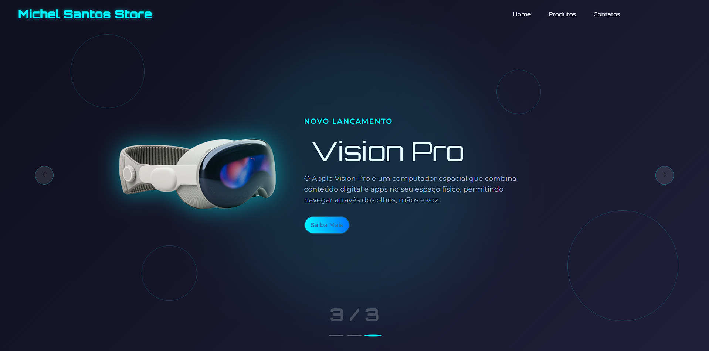

# 🚀 Animated Responsive Landing Page

Este projeto é uma **landing page moderna** desenvolvido com **HTML5**, **CSS3** e **JavaScript**, com foco em **responsividade**, **animações dinâmicas** e **experiência do usuário fluida**.

A estrutura foi criada utilizando **Flexbox** e animações CSS combinadas com **JavaScript** para gerenciar interações, efeitos visuais e mudanças de estado de forma elegante.

O site é totalmente adaptável para diferentes dispositivos (mobile, tablet e desktop), mantendo a performance, a estética e a interatividade em todos os tamanhos de tela.

## ✨ Principais Características:

* **HTML5 semântico** para melhor acessibilidade e SEO.
* **CSS3 avançado** com animações suaves, efeitos de hover e transições responsivas.
* **JavaScript Vanilla** para controle de slides, botões e elementos dinâmicos.
* **Design responsivo** (mobile-first) com adaptação automática ao tamanho da tela.
* **Foco em UX/UI**, garantindo uma navegação intuitiva e agradável.

## 📚 Tecnologias Utilizadas:

* HTML5
* CSS3
* JavaScript (ES6+)

## 🌟 Aplicações Possíveis:

* Landing pages institucionais
* Portfólios modernos
* Apresentação de produtos ou startups
* Sites promocionais

---

> Projeto criado com foco em **animação, responsividade** e **performance** para dispositivos modernos.

---

## 💼 Demonstração

## 🔗 Links
<a href="https://vision-prodevclub.netlify.app/">* [Deploy]</a> 
<a href="https://portifolio-michel.netlify.app/#Projetos">* [Meu Portfólio]</a> 
<a href="https://www.linkedin.com/in/michel-santos-1b3b1b6a/">* [LinkedIn]</a>
